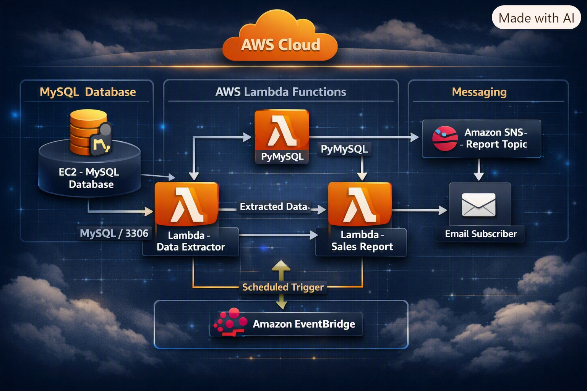

## Automação Serverless de Relatórios de Vendas com AWS Lambda


<p align="center">
  
</p>


Este laboratório foi meu primeiro contato mais completo com uma arquitetura serverless na AWS.

A proposta era automatizar a extração de dados de pedidos de uma cafeteria, consultar um banco MySQL hospedado em uma instância EC2 e enviar um relatório por e-mail usando Amazon SNS.

Na prática, eu precisava fazer vários serviços diferentes conversarem:

- O Lambda precisava acessar o banco.
- O IAM precisava permitir somente as ações necessárias.
- O PyMySQL precisava estar disponível para o código Python.
- O SNS precisava enviar o relatório.
- O EventBridge precisava disparar a execução automaticamente.
- E tudo isso precisava funcionar sem manter um servidor dedicado apenas para gerar o relatório.

---

## O desafio

O cenário era uma aplicação de cafeteria com dados de pedidos armazenados em um banco MySQL.

A ideia era criar um processo automático que:

1. Acessasse o banco de dados.
2. Extraísse os dados dos pedidos.
3. Gerasse um relatório de vendas.
4. Publicasse esse relatório em um tópico SNS.
5. Enviasse o resultado por e-mail.
6. Executasse tudo automaticamente em horários programados.

Antes deste laboratório, eu já tinha trabalhado com dados usando SQL, Snowflake e Power BI. Aqui, o desafio foi entender o que acontece antes da análise chegar ao dashboard:

- Como a função acessa o banco?
- Como o código recebe as permissões?
- Como uma dependência Python é disponibilizada no Lambda?
- Como uma execução automática é agendada?
- Como um erro de rede aparece quando não existe um servidor para acessar manualmente?

Foi uma experiência interessante porque o código da função era relativamente pequeno, mas a arquitetura ao redor exigia bastante atenção.

---

## Como eu organizei a solução

Separei a solução em duas funções Lambda:

### Função extratora

A função `salesAnalysisReportDataExtractor` ficou responsável por:

- Acessar o banco MySQL.
- Executar as consultas necessárias.
- Extrair os dados de vendas.
- Preparar as informações para o relatório.
- Retornar os dados para a próxima etapa.

### Função principal do relatório

A função `salesAnalysisReport` ficou responsável por:

- Acionar o processo do relatório.
- Receber ou utilizar os dados extraídos.
- Formatar o conteúdo.
- Publicar a mensagem no Amazon SNS.
- Enviar o relatório para os assinantes do tópico.

Essa separação ajudou a dividir responsabilidades. Uma função cuida da extração; a outra cuida da entrega do resultado.

---

## Arquitetura da solução

```mermaid




### Fluxo da arquitetura

1. O EventBridge dispara a função principal em um horário definido.
2. A função de relatório utiliza a função extratora.
3. A função extratora acessa o MySQL na instância EC2.
4. O PyMySQL é disponibilizado por meio de uma Lambda Layer.
5. Os dados são organizados em formato de relatório.
6. A função principal publica a mensagem no tópico SNS.
7. O SNS entrega o relatório ao endereço de e-mail confirmado.

---

## Serviços e tecnologias utilizados

- **AWS Lambda** — Execução do código Python sem gerenciar servidores.
- **Python 3.9** — Linguagem utilizada nas funções.
- **AWS Lambda Layers** — Compartilhamento da dependência PyMySQL.
- **AWS IAM** — Criação dos papéis e permissões das funções.
- **Amazon VPC** — Conexão da função Lambda com o ambiente da cafeteria.
- **Security Groups** — Controle do acesso ao banco MySQL.
- **Amazon EC2** — Instância que hospedava o banco MySQL.
- **Amazon SNS** — Envio dos relatórios por e-mail.
- **Amazon EventBridge** — Agendamento automático das execuções.
- **AWS CLI** — Criação e gerenciamento de recursos pela linha de comando.
- **CloudWatch Logs** — Consulta dos logs e acompanhamento das execuções.

---

## Criando a Lambda Layer

A função precisava utilizar a biblioteca `PyMySQL` para se conectar ao banco MySQL.

Em vez de colocar a dependência diretamente em cada função, criei uma Lambda Layer chamada:

```text
pymysqlLibrary
```

A biblioteca foi empacotada em um arquivo `.zip` e adicionada à camada.

A ideia de usar uma Layer foi separar o código da aplicação das dependências externas. Assim, a biblioteca pode ser reutilizada por outras funções sem precisar ser empacotada novamente em cada implantação.

A estrutura da camada precisa seguir o formato esperado pelo runtime Python do Lambda:

```text
python/
└── pymysql/
```

Depois de criar a camada, associei a `pymysqlLibrary` à função:

```text
salesAnalysisReportDataExtractor
```

Essa foi uma parte importante porque mostrou que uma função Lambda não deve ser pensada apenas como um arquivo Python. O runtime, as dependências, as permissões e a rede também fazem parte da solução.

---

## Configuração dos papéis IAM

Criei papéis de execução separados para as funções Lambda.

### `salesAnalysisReportRole`

Esse papel foi utilizado pela função principal do relatório e recebeu permissões relacionadas a:

- Publicação de mensagens no Amazon SNS.
- Leitura de parâmetros no Systems Manager.
- Registro de logs no CloudWatch.
- Invocação de outras funções Lambda.

### `salesAnalysisReportDERole`

Esse papel foi utilizado pela função extratora e recebeu permissões relacionadas a:

- Criação de logs no CloudWatch.
- Acesso aos recursos de rede necessários para executar dentro da VPC.

O objetivo foi evitar que as duas funções utilizassem exatamente o mesmo conjunto de permissões.

Essa separação ajuda a entender melhor o princípio do menor privilégio: cada função deve ter somente o acesso necessário para realizar sua responsabilidade.

Durante o laboratório, também ficou claro que uma permissão pode parecer correta no IAM, mas ainda assim o recurso não funcionar se existir algum bloqueio de rede ou uma regra de negação mais específica.

---

## Configurando o acesso ao banco

Para consultar o banco MySQL hospedado na EC2, associei a função extratora à VPC da cafeteria.

A configuração envolveu:

- VPC da aplicação.
- Subnet utilizada pelo ambiente.
- `CafeSecurityGroup`.
- Comunicação com a instância EC2.
- Acesso ao MySQL pela porta `3306`.

Essa etapa foi necessária porque a função precisava sair do ambiente Lambda e alcançar um recurso que estava dentro da infraestrutura da cafeteria.

O Lambda não conseguiu acessar o banco apenas por ter código Python e credenciais. A função também precisava estar conectada corretamente à rede e autorizada pelo Security Group.

---

## O problema do timeout

O primeiro teste da função extratora falhou com o seguinte erro:

```json
{
  "errorMessage": "Task timed out after 3.00 seconds"
}
```

No início, o erro poderia parecer relacionado ao código ou à consulta SQL. Mas o comportamento indicava que a função estava esperando uma resposta que nunca chegava.

O timeout padrão de três segundos foi atingido porque a função não conseguia estabelecer comunicação com o banco MySQL.

### Investigação

Revisei:

- A VPC associada à função.
- A subnet configurada.
- O Security Group.
- O endpoint utilizado para conexão.
- A porta padrão do MySQL.
- O estado da instância EC2.
- O conteúdo do banco.

A causa estava nas regras de entrada do `CafeSecurityGroup`.

O grupo de segurança do banco não permitia a conexão recebida pela porta:

```text
3306
```

### Correção

Ajustei as regras de entrada do Security Group para permitir a comunicação necessária entre a função Lambda e o banco MySQL.

Também acessei a aplicação da cafeteria para inserir pedidos reais no sistema. Isso foi importante porque o banco precisava ter dados para que a extração pudesse ser validada de verdade.

Depois da correção, a função passou a retornar:

```json
{
  "statusCode": 200
}
```

Essa foi uma das partes mais importantes do laboratório. O erro não era resolvido apenas aumentando o timeout. Era necessário encontrar o problema real na comunicação entre a função e o banco.

A lição foi direta:

> Quando um Lambda conectado a uma VPC sofre timeout, não devo olhar apenas para o código. Preciso investigar rede, Security Groups, subnets, rotas e disponibilidade do recurso de destino.

---

## Configurando o Amazon SNS

Depois de validar a extração dos dados, criei o tópico:

```text
salesAnalysisReportTopic
```

Em seguida:

1. Adicionei um endereço de e-mail como assinante.
2. Aguardei a mensagem de confirmação.
3. Confirmei a inscrição pelo link recebido.
4. Publiquei o relatório no tópico.
5. Validei o recebimento do e-mail.

A confirmação da assinatura é uma etapa simples, mas necessária. Sem ela, o tópico pode publicar mensagens corretamente e, mesmo assim, o destinatário não receber o relatório.

A função principal utilizou uma variável de ambiente para armazenar o ARN do tópico:

```text
topicARN
```

Isso evita deixar o ARN diretamente espalhado pelo código e facilita a troca do tópico entre diferentes ambientes.

---

## Automatizando com EventBridge

Depois de testar as funções manualmente, configurei um gatilho do Amazon EventBridge para executar o relatório automaticamente.

A expressão utilizada foi:

```text
cron(15 4 ? * MON-SAT *)
```

Essa expressão agenda a execução para:

- Minuto: `15`
- Hora: `4`
- Dias da semana: segunda a sábado
- Meses: todos
- Anos: todos

O agendamento utiliza o formato de seis campos do cron da AWS:

```text
cron(minuto hora dia-do-mês mês dia-da-semana ano)
```

Um ponto importante é observar o fuso horário. A expressão é interpretada de acordo com a configuração do serviço e, dependendo do recurso utilizado, pode exigir conversão para UTC.

Por isso, em uma implementação real, eu confirmaria sempre se o horário configurado corresponde ao horário esperado para o negócio.

---

## Uso da AWS CLI

Também utilizei a AWS CLI para criar e configurar recursos.

O fluxo incluiu:

- Acesso ao terminal por meio do EC2 Instance Connect.
- Configuração das credenciais com `aws configure`.
- Criação da função Lambda.
- Associação do papel IAM.
- Definição do runtime Python.
- Configuração das variáveis de ambiente.
- Gerenciamento dos recursos pela linha de comando.

Um exemplo do comando utilizado para criação da função foi:

```bash
aws lambda create-function
```

A utilização da CLI ajudou a entender que o console da AWS é apenas uma das formas de trabalhar com os serviços. As mesmas configurações podem ser realizadas por comandos, scripts ou, em uma próxima evolução, usando Infrastructure as Code.

---

## Como executar e testar

Antes de testar as funções, é necessário confirmar que o banco está disponível e possui dados.

### Pré-requisitos

- Instância EC2 da cafeteria em execução.
- Banco MySQL ativo.
- Tabelas criadas.
- Pedidos registrados na aplicação.
- Funções Lambda configuradas.
- Lambda Layer com PyMySQL associada.
- Security Group permitindo a comunicação pela porta `3306`.
- Assinatura do SNS confirmada.
- ARN do tópico configurado na variável `topicARN`.

### Teste da função extratora

Acesse o console do AWS Lambda e execute um teste da função:

```text
salesAnalysisReportDataExtractor
```

Utilize o evento:

```text
SARDETestEvent
```

Verifique:

- O status da execução.
- Os dados retornados.
- Os logs no CloudWatch.
- A duração da execução.
- Possíveis erros de conexão com o MySQL.

### Teste da função de relatório

Depois de validar a extração, execute:

```text
salesAnalysisReport
```

Verifique:

- Se a função foi executada com sucesso.
- Se os dados foram formatados.
- Se a mensagem foi publicada no SNS.
- Se o e-mail foi recebido pelo assinante.

### Validação automática

Depois dos testes manuais, aguarde o horário definido no EventBridge ou ajuste temporariamente a regra para um horário próximo.

A validação final deve confirmar o fluxo completo:

```text
EventBridge → Lambda → MySQL → SNS → E-mail
```

---

## Resultado

Ao final do laboratório, consegui montar um fluxo serverless para extração e envio automatizado de relatórios de vendas.

O resultado foi:

- Função Lambda conectada ao banco MySQL.
- Dependência PyMySQL disponibilizada por Lambda Layer.
- Permissões IAM separadas para as funções.
- Acesso controlado pela VPC e pelo Security Group.
- Relatório publicado no Amazon SNS.
- E-mail recebido após confirmação da assinatura.
- Execução automática configurada pelo EventBridge.
- Problema de timeout investigado e corrigido.
- Dados reais da aplicação utilizados na validação.

Mais importante do que apenas fazer o relatório chegar por e-mail foi entender cada parte do caminho e descobrir onde a comunicação estava falhando.

---

## O que este laboratório me ensinou

Este laboratório me mostrou que serverless não significa ausência de infraestrutura.

Eu não precisei gerenciar um servidor para executar o código, mas ainda precisei lidar com:

- Rede.
- Subnets.
- Security Groups.
- IAM.
- Dependências Python.
- Variáveis de ambiente.
- Logs.
- Agendamento.
- Integração entre serviços.

O erro de timeout foi especialmente importante porque me obrigou a investigar além do código. A função parecia correta, mas não conseguia chegar ao banco.

Também entendi melhor que:

- Permissão IAM não resolve um bloqueio de rede.
- Uma função dentro de uma VPC precisa de uma configuração de conectividade adequada.
- Um Security Group pode impedir totalmente a comunicação mesmo quando o serviço está funcionando.
- Logs e mensagens de erro são parte do processo de investigação.
- Automatizar uma rotina exige pensar no fluxo inteiro, e não somente na função que executa o código.

Como analista de dados, eu já estava acostumada a olhar para o resultado final. Neste projeto, precisei olhar para o caminho completo que transforma os dados do banco em uma informação entregue para alguém.

---

## Considerações sobre custos

Mesmo sendo um laboratório, precisei considerar que cada serviço pode gerar custos dependendo da configuração e do tempo de uso.

Alguns pontos que merecem atenção:

- Funções Lambda são cobradas de acordo com execução e duração, dentro das regras do serviço.
- O banco MySQL na EC2 continua gerando custos enquanto a instância estiver ativa.
- Recursos de rede, como NAT Gateway, podem aumentar bastante o custo de uma arquitetura.
- Logs acumulados no CloudWatch precisam de uma política de retenção.
- Tópicos SNS, mensagens e assinaturas devem ser revisados quando o laboratório terminar.
- EventBridge pode continuar disparando funções se a regra permanecer ativa.
- Recursos temporários precisam ser desligados ou removidos depois dos testes.

Uma rotina serverless pode reduzir a necessidade de manter servidores exclusivos para tarefas agendadas, mas isso não significa que a arquitetura seja automaticamente gratuita.

A pergunta continua sendo:

> Qual é a frequência da execução, quanto tempo ela permanece ativa e quais recursos ficam ligados ao redor dela?

---

## Próximos passos

Este laboratório funcionou, mas ainda existem várias formas de evoluir a solução.

### Infraestrutura como código

- Recriar Lambda, IAM, SNS, EventBridge, VPC e Security Groups usando Terraform.
- Organizar os recursos em módulos.
- Utilizar variáveis para separar ambientes.

- ## Meus Contatos

- Linkedin : www.linkedin.com/in/eliana-diniz
- email: eliana.dinizsilva@gmail.com
-
